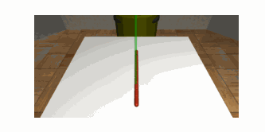

# rope-manipulation

Manipulating rope to different goal states using Mujoco.

## Quick Start

1. Create conda environment + install dm_control

```
conda env create --file environment.yaml
```

Install [dm_control](https://github.com/deepmind/dm_control#requirements-and-installation)


2. Run the tuning.py to view the PID controller tuning results

```
python tuning.py
```

4. In the `mujoco` folder, run `explorer_dataset.py` to generate the dataset
```
python explorer_dataset.py
```

For the training, make sure to comment out the `wandb` functions such as log, init as it won't work on machines other than the owners.

5. In the `learning` folder, run `train_inv_dyn.py` to run the training for the inverse dynamics model 
```
python train_inv_dyn.py
```
5. In the `learning` folder, run `train_infogan.py` to run the training for the infogan model 
```
python train_infogan.py
```



## Run 

## To-do

- [x] Basic env with rope + panda
- [x] Position Controller for Panda
- [ ] Learn low-dim plan representation from image start/goal configurations according to [Learning Plannable Representations with Causal InfoGAN](https://arxiv.org/abs/1807.09341)
- [ ] Execute plans using MPC

## Sources
- Panda Mujoco xml model adapted from https://github.com/justagist/mujoco_panda
